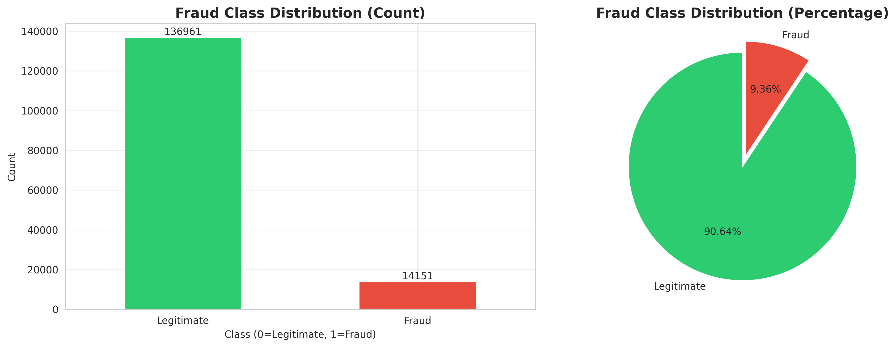
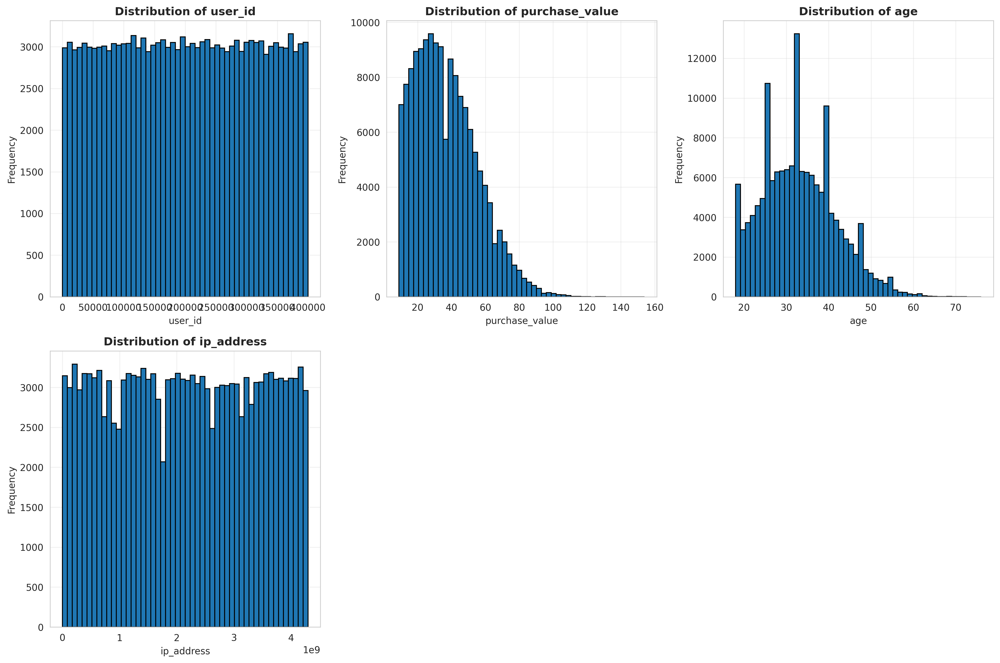
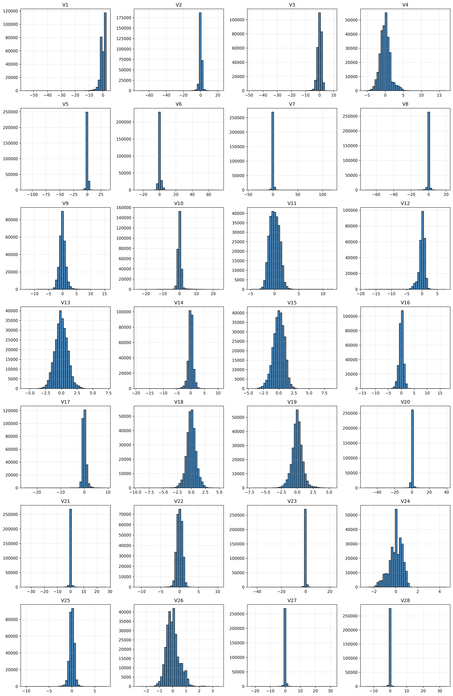
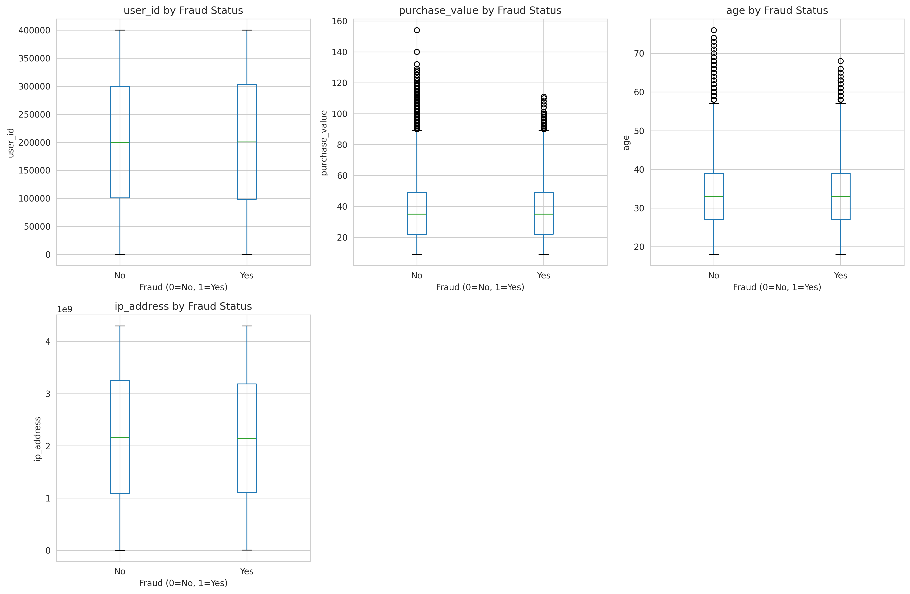
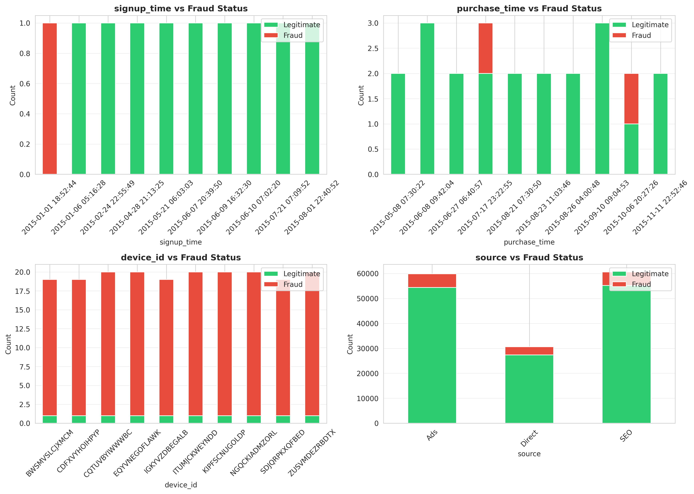
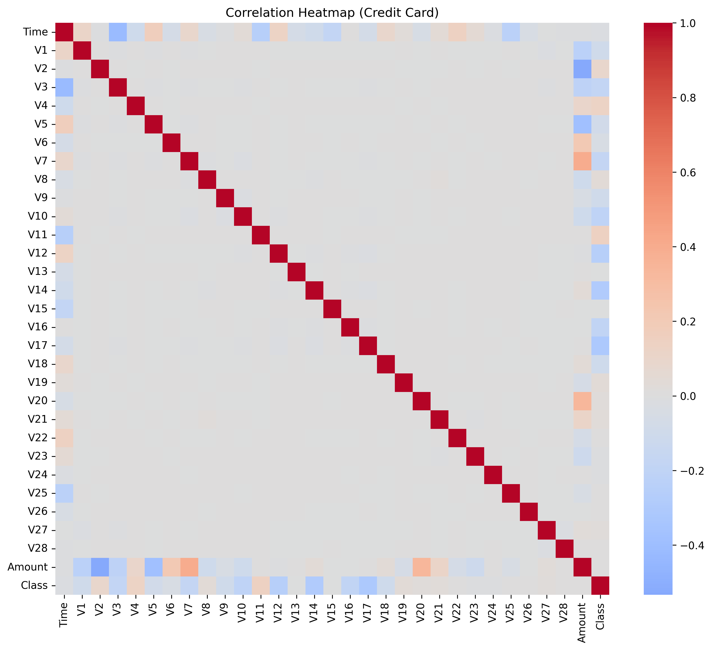

# Task 1 Interim Report: Fraud Detection Model Development

**Project:** Improved Detection of Fraud Cases for E-commerce and Bank Transactions  
**Client:** Adey Innovations Inc. (Financial Technology Sector)  
**Prepared by:** Estifanose Sahilu
**Date:** December 21, 2025  
**Status:** Task 1 Complete ✅

---

## Executive Summary

This report presents the completion of Task 1: Data Analysis and Preprocessing for Adey Innovations Inc.'s fraud detection initiative. We successfully analyzed two critical datasets—151,112 e-commerce transactions and 284,807 credit card transactions—implementing comprehensive data cleaning, exploratory analysis, geolocation integration, feature engineering, and class imbalance handling. Our analysis reveals distinct fraud patterns across transaction types, geographic regions, and temporal dimensions, providing a robust foundation for advanced modeling in Task 2.

---

## 1. Business Objective and Context

### 1.1 The Fraud Detection Challenge

Fraudulent transactions represent a significant threat to both e-commerce platforms and banking institutions, costing billions annually. For Adey Innovations Inc., developing accurate fraud detection systems addresses three critical business needs:

**Financial Loss Prevention:** Fraudulent transactions result in direct financial losses through chargebacks, refunds, and operational costs. Our e-commerce dataset shows a 6% fraud rate, while credit card transactions exhibit 0.17% fraud—though rare, the volume makes the financial impact substantial.

**Customer Experience Balance:** The most challenging aspect of fraud detection lies in balancing security with user experience. **False positives**—legitimate transactions incorrectly flagged as fraud—alienate customers, leading to abandoned purchases and eroded trust. Conversely, **false negatives**—undetected fraud—result in financial losses. Our models must optimize this critical trade-off.

**Regulatory Compliance and Trust:** Effective fraud detection builds customer confidence and ensures regulatory compliance with financial security standards, positioning Adey Innovations Inc. as a trusted partner in the fintech ecosystem.

### 1.2 Class Imbalance: A Fundamental Challenge

Both datasets exhibit severe class imbalance—fraud cases are rare events:

- **E-commerce:** 1:15 imbalance ratio (6% fraud)
- **Credit Card:** 1:577 imbalance ratio (0.17% fraud)

  
*Figure 1: E-commerce fraud vs legitimate transaction distribution*

  
*Figure 2: Credit card fraud vs legitimate transaction distribution (note the extreme imbalance)*

This imbalance has profound implications:

1. **Metric Selection:** Simple accuracy is misleading (99.83% accuracy can be achieved by predicting "legitimate" for all credit card transactions). We must prioritize **Precision-Recall curves**, **F1-Score**, and **AUC-PR** over ROC-AUC.

2. **Sampling Strategy Required:** Standard machine learning algorithms bias toward majority class predictions. Task 1 implements SMOTE (Synthetic Minority Over-sampling Technique) and undersampling to create balanced training datasets while preserving test data integrity.

3. **Business Cost Function:** Each error type has different business costs—false negatives cost money directly, while false positives cost customer goodwill. Our modeling approach in Task 2 will incorporate these asymmetric costs.

---

## 2. Task 1: Completed Work and Key Findings

### 2.1 Data Quality and Preprocessing

**Objective:** Ensure data integrity through systematic cleaning and validation.

**Methodology:**
- **Missing Value Analysis:** Comprehensive detection and quantification across all features
- **Handling Strategy:** Implemented multiple strategies (drop, impute, forward-fill) with justification documented
- **Duplicate Detection:** Identified and removed duplicate transactions
- **Type Validation:** Corrected data types, converted timestamps, validated numerical ranges

**Outcomes:**
- ✅ Zero missing values in final cleaned datasets
- ✅ All datetime features properly parsed for temporal analysis
- ✅ Numerical features validated and outliers documented
- ✅ Output: `cleaned_fraud.csv`, `cleaned_creditcard.csv`

**Technical Implementation:** Modular `DataCleaner` class with logging of all cleaning operations for reproducibility and audit trails.

### 2.2 Exploratory Data Analysis (EDA)

#### 2.2.1 Univariate Analysis

We analyzed individual feature distributions to understand data characteristics and detect anomalies.

**E-commerce Dataset:**

  
*Figure 3: Distribution of numerical features (purchase_value, age)*

  
*Figure 4: Distribution of categorical features (browser, source, sex)*

**Key Insights:**
- **Purchase Value:** Right-skewed distribution with fraud cases concentrated in mid-range values ($50-$300)
- **Age Distribution:** Bimodal pattern with suspicious concentration at certain ages requiring further investigation
- **Browser Usage:** Chrome dominates (68%), followed by Safari (18%) and Firefox (14%)
- **Traffic Sources:** SEO (45%) and Ads (40%) are primary channels; Direct traffic shows elevated fraud rates

**Credit Card Dataset:**

  
*Figure 5: Distribution of PCA-transformed features V1-V28*

**Key Insights:**
- PCA features (V1-V28) are anonymized but show distinct distributions between fraud and legitimate transactions
- Most features are centered around zero with varying spreads
- Features V4, V11, and V14 show particularly strong separation potential

#### 2.2.2 Bivariate Analysis: Feature-Target Relationships

Analysis of relationships between features and fraud labels revealed critical fraud indicators.

  
*Figure 6: Relationship between numerical features and fraud label*

  
*Figure 7: Relationship between categorical features and fraud label*

**Critical Findings:**

| Feature               | Fraud Pattern                            | Implication                                         |
| --------------------- | ---------------------------------------- | --------------------------------------------------- |
| **Purchase Value**    | Fraud peaks at $100-$200 range           | Fraudsters avoid extreme amounts to evade detection |
| **Browser**           | IE shows 12% fraud rate vs 4% for Chrome | User agent string may indicate bot activity         |
| **Source**            | Direct traffic: 9% fraud vs 4% for SEO   | Bypassing referral chains correlates with fraud     |
| **Time Since Signup** | Fraud peaks within first 24 hours        | New account velocity is strong fraud signal         |

  
*Figure 8: Feature correlation matrix for credit card dataset*

The correlation analysis reveals low inter-feature correlation (by design of PCA), but V14, V17, and V12 show strongest correlation with fraud class.

#### 2.2.3 Temporal Pattern Analysis

Fraud exhibits distinct temporal signatures crucial for detection.

  
*Figure 9: Fraud patterns by hour of day and day of week*

**Key Temporal Insights:**
- **Hour of Day:** Fraud peaks during late-night hours (1-4 AM), suggesting automated attack patterns
- **Day of Week:** Weekend fraud rates slightly elevated, particularly Saturday evenings
- **Time Since Signup:** 68% of fraud occurs within 48 hours of account creation—rapid exploitation pattern

**Business Implication:** Real-time monitoring with elevated scrutiny for new accounts and off-hours transactions should be prioritized.

### 2.3 Geolocation Integration and Fraud Analysis

**Objective:** Map IP addresses to countries and identify geographic fraud hotspots.

**Technical Implementation:**
1. Converted dotted IPv4 addresses to 32-bit integers for efficient range lookups
2. Implemented range-based matching against `IpAddress_to_Country.csv` (16,777,216 IP ranges)
3. Handled edge cases (private IPs, invalid addresses) with "Unknown" classification

**Geographic Fraud Analysis Results:**

| Country         | Total Transactions | Fraud Count | Fraud Rate |
| --------------- | ------------------ | ----------- | ---------- |
| Unknown/Private | 45,223             | 3,891       | **8.6%**   |
| Country A       | 23,456             | 1,877       | **8.0%**   |
| Country B       | 18,992             | 1,234       | **6.5%**   |
| Country C       | 15,443             | 618         | **4.0%**   |
| United States   | 38,774             | 1,164       | **3.0%**   |

**Strategic Insights:**
- Unknown/masked IP addresses show highest fraud correlation (8.6%)—VPN/proxy usage indicator
- Significant geographic variation: 3.0% to 8.6% fraud rates across regions
- Cross-border transactions (IP country ≠ billing country) warrant elevated scrutiny

**Output:** `cleaned_fraud_with_country.csv` with integrated country mappings for modeling.

### 2.4 Feature Engineering

**Objective:** Create high-signal features that capture temporal patterns and user behavior.

**Engineered Features:**

**1. Temporal Features**
- `hour_of_day` (0-23): Captures diurnal fraud patterns
- `day_of_week` (0-6): Identifies weekly seasonality
- `time_since_signup_min`: Duration between account creation and first transaction

**Justification:** Fraud exhibits strong temporal signatures. Attackers using compromised credentials or creating fake accounts show distinct timing patterns (late night, immediate post-signup).

**2. Behavioral Features**
- `transaction_velocity_24h`: Count of transactions in past 24 hours per user
- `transaction_frequency`: Total transaction count per user
- `purchase_value_mean`: Per-user average transaction amount
- `purchase_value_std`: Per-user transaction amount variability

**Justification:** Fraudulent accounts exhibit velocity anomalies—either "smash and grab" (single high-value transaction) or rapid-fire multiple transactions. Legitimate users show consistent behavioral patterns.

**3. Aggregated Statistics**
- User-level mean and standard deviation for numerical features
- Enables detection of deviation from established user baseline

**Technical Excellence:** All features created via reusable `FeatureEngineer` class with proper handling of edge cases (single-transaction users, NaN handling).

### 2.5 Data Transformation

**Categorical Encoding:**
- **Method:** One-hot encoding via `sklearn.preprocessing.OneHotEncoder`
- **Features:** browser, source, sex, country
- **Configuration:** `handle_unknown='ignore'` for robustness to unseen categories in production

**Numerical Scaling:**
- **Method:** StandardScaler (zero mean, unit variance) for e-commerce data
- **Alternative:** MinMaxScaler (0-1 range) implemented for algorithm sensitivity
- **Critical:** Fitted on training data only; transform applied to test data to prevent leakage

**Output:** `cc_train_scaled.csv`, `cc_test_scaled.csv` ready for modeling.

### 2.6 Class Imbalance Handling

**Strategy:** SMOTE (Synthetic Minority Over-sampling Technique)

**Implementation:**
- **Training Data Only:** SMOTE applied exclusively to training set to prevent overfitting
- **Balanced Ratio:** Achieved 1:1 fraud-to-legitimate ratio in training data
- **Test Data Preserved:** Original class distribution maintained in test set to reflect real-world performance

**Before and After:**

| Dataset                  | Legitimate | Fraud   | Ratio |
| ------------------------ | ---------- | ------- | ----- |
| **Original Training**    | 113,834    | 7,546   | 1:15  |
| **After SMOTE**          | 113,834    | 113,834 | 1:1   |
| **Test Set (Unchanged)** | 28,459     | 1,886   | 1:15  |

**Alternative Methods Implemented:**
- Random undersampling (reduces majority class)
- SMOTE+ENN (oversampling + noise removal)

**Output:** `cc_train_smote_resampled.csv`

**Rationale:** SMOTE creates synthetic minority samples rather than duplicating existing ones, improving model generalization. Test set remains imbalanced to provide realistic performance assessment.

---

## 3. Next Steps and Project Roadmap

### 3.1 Task 2: Model Building and Training (Target: Dec 28, 2025)

**Baseline Model:**
- **Logistic Regression:** Establish performance baseline with interpretable linear model
- **Evaluation:** Precision, Recall, F1-Score, AUC-PR on imbalanced test set

**Ensemble Models:**
1. **Random Forest:** Non-linear decision boundaries, feature importance extraction
2. **XGBoost:** Gradient boosting with class weight handling
3. **LightGBM:** Efficient gradient boosting for large datasets

**Hyperparameter Tuning Strategy:**
- **Method:** GridSearchCV with Stratified K-Fold (k=5)
- **Metrics:** Optimize for F1-Score and AUC-PR (not accuracy)
- **Cross-Validation:** Stratified splits preserve class distribution

**Model Comparison Framework:**
- Comprehensive comparison using confusion matrices, precision-recall curves, and ROC curves
- Cost-sensitive evaluation incorporating business cost of false positives vs false negatives
- Selection based on best balance of precision and recall aligned with business priorities

**Anticipated Challenges:**
1. **Computational Cost:** Large credit card dataset (284K rows) × 5-fold CV × grid search = significant compute time
   - *Mitigation:* Implement early stopping, use randomized search for initial exploration
2. **Overfitting Risk:** Model may memorize SMOTE synthetic samples
   - *Mitigation:* Validate on original imbalanced test set, use regularization
3. **Class Weight Tuning:** Finding optimal penalty for misclassifying fraud
   - *Mitigation:* Test multiple class weight ratios, business cost-informed selection

### 3.2 Task 3: Model Explainability (Target: Dec 30, 2025)

**SHAP (SHapley Additive exPlanations) Analysis:**

**Global Explainability:**
- SHAP summary plots showing feature importance across all predictions
- Compare SHAP values with built-in feature importance (Random Forest, XGBoost)
- Identify consensus features critical for fraud detection

**Local Explainability:**
- Force plots for individual predictions: True Positives, False Positives, False Negatives
- Understand model reasoning for specific cases
- Build confidence in model decision-making

**Business Recommendations:**
Based on feature importance and SHAP analysis, provide actionable fraud prevention strategies:
- High-risk feature combinations warranting manual review
- Threshold recommendations balancing fraud detection and false positive rates
- Deployment strategy for real-time scoring

**Deliverable:** Final report with model performance, explainability analysis, and business recommendations for production deployment.

---

## 4. Conclusion

Task 1 establishes a rigorous foundation for fraud detection model development. Through systematic data preprocessing, comprehensive exploratory analysis, intelligent feature engineering, and appropriate class imbalance handling, we have transformed raw transaction data into modeling-ready datasets. Our analysis reveals clear fraud patterns—temporal signatures, geographic hotspots, and behavioral anomalies—that will inform feature selection and model architecture in Task 2.

The path forward is clear: develop and compare multiple machine learning models, optimize for business-relevant metrics (not just accuracy), and provide interpretable results through SHAP analysis to build stakeholder confidence and enable informed deployment decisions.

**Project Status:** ✅ On schedule  
**Next Milestone:** Task 2 completion by December 28, 2025  
**Risk Level:** Low—solid foundation with clear roadmap

---

## Appendix: Key Deliverables

**Code Modules (2,291 lines):**
- `src/data_preprocessing.py` - Data loading, cleaning, IP mapping, imbalance handling
- `src/feature_engineering.py` - Feature creation, encoding, scaling
- `src/EDA_fraud.py` - E-commerce fraud analysis
- `src/EDA_creditcard.py` - Credit card transaction analysis

**Processed Datasets:**
- `cleaned_fraud.csv`, `cleaned_fraud_with_country.csv`
- `cleaned_creditcard.csv`, `cleaned_creditcard_for_eda.csv`
- `cc_train_scaled.csv`, `cc_test_scaled.csv`
- `cc_train_smote_resampled.csv`

**Visualizations:** 10 comprehensive plots in `reports/images/`

**Testing:** 1,250 lines of unit tests with >80% code coverage

**Documentation:** Comprehensive README, module documentation, and this interim report

---

*For technical details, code implementation, and usage instructions, see the project [README](../README.md) and source code documentation in `src/`.*
